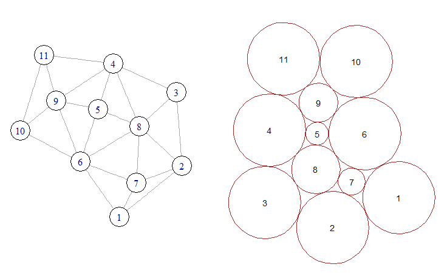

Another approach to circle packing is to begin with a specification of circle sizes and tangencies (ie. 
which circles touch which other circles) and then search for an arrangement satisfying this. Such an 
algorithm was described by Collins and Stephenson in a [2003 paper](http://www.sciencedirect.com/science/article/pii/S0925772102000998) in the journal Computation Geometry Theory and Applications. A version of their algorithm was implemented in Python by David Eppstein as part of his PADS library (see [CirclePack.py](http://www.ics.uci.edu/~eppstein/PADS/)). A port of this version to R/Rcpp is included in the packcircles package.

In the figure below, the graph on the left represents the desired pattern of circle tangencies. Circles 5, 7, 8 and 9 are *internal*, while the remaining circles are *external*. The packing on the right shows an arrangement of circles which conforms to the input graph.



The function `circleGraphLayout` implements a basic version of the algorithm. The following example produces a layout similar to the above figure:

```{r, eval=FALSE}

library(packcircles)
library(ggplot2)

## List of tangencies. Vector elements are circle IDs.
## The first element in each vector is an internal circle
## and the subsequent elements are its neighbours.
internal <- list(
  c(9, 4, 5, 6, 10, 11),
  c(5, 4, 8, 6, 9),
  c(8, 3, 2, 7, 6, 5, 4),
  c(7, 8, 2, 1, 6)
)

## Specification of external circle radii.
external <- data.frame(id = c(1, 2, 3, 4, 6, 10, 11), radius=10.0)

## The circleGraphLayout function is used to find an arrangement
## of circles corresponding to the tangencies specified by `internal`
## and the external circle sizes specified by `external`. The
## result is a four-column data.frame: id, x, y, radius.
##
layout <- circleGraphLayout(internal, external)

## Get data for circle vertices.
plotdat <- circleLayoutVertices(layout, xysizecols = 2:4, idcol = 1)

## Draw circles annotated with their IDs.
ggplot() +
  geom_polygon(data=plotdat, aes(x, y, group=id), 
               fill=NA, colour="black") +
  
  geom_text(data=layout, aes(x, y, label=id)) +
  
  coord_equal() +
  
  theme_bw()

```

